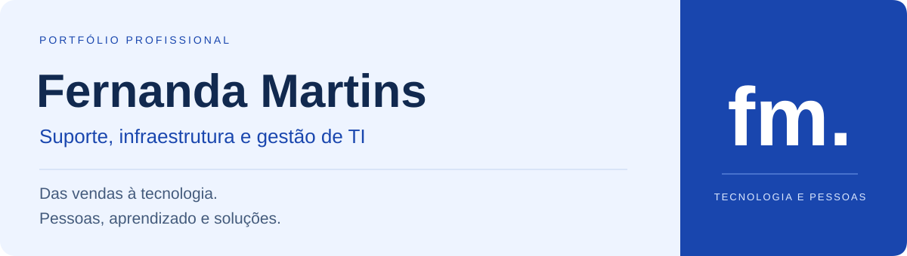

# Olá, sou a Fernanda Martins 👋

## [Visite meu portfólio completo ↗](https://fernandalsmartins.github.io/FernandaLsMartins/)

Conheça minha atuação e o projeto CEN no meu site profissional.

Sou uma pessoa comunicativa, empática, ética e apaixonada por aprender e enfrentar novos desafios.

Minha trajetória profissional começou cedo, na área de vendas, ajudando minha mãe com vestidos de festa e, posteriormente, seguindo profissionalmente no setor comercial. Foi nesse ambiente que desenvolvi habilidades que carrego até hoje: comunicação, escuta, negociação, relacionamento com pessoas e, principalmente, a capacidade de entender problemas e buscar soluções.

A tecnologia, porém, sempre esteve presente na minha vida. Mesmo sem atuar formalmente na área, sempre tive interesse por redes, hardware e suporte, e frequentemente acabava ajudando com questões de tecnologia nas empresas em que trabalhava.

Por precisar trabalhar, interrompi meus estudos ainda jovem e, durante muito tempo, tive apenas o ensino médio incompleto. Até que uma conversa mudou minha perspectiva: uma cliente de 60 anos me contou que estava concluindo sua faculdade. Aquilo me mostrou, de uma forma muito simples, que nunca era tarde para recomeçar.
No mesmo ano, fiz o Encceja, concluí o ensino médio e iniciei minha graduação em Gestão da Tecnologia da Informação.

Minha entrada profissional na área de TI aconteceu por meio de um estágio em uma empresa de construção civil. Em menos de cinco meses, fui efetivada e passei a assumir responsabilidades cada vez maiores.

Hoje, atuo com suporte técnico, infraestrutura, redes, segurança da informação e controle de ativos e estoque. Também ministro treinamentos sobre ferramentas corporativas, segurança da informação e LGPD para mais de 400 usuários distribuídos entre operações e unidades como Petrobras, Ternium e outras.

Paralelamente, desenvolvo um sistema inteligente de gestão e controle de almoxarifado, todo em python usando PostgreSQL , aplicando tecnologia para resolver problemas que observo no próprio ambiente de trabalho.

Minha trajetória me ensinou que tecnologia não é apenas sobre sistemas, equipamentos ou códigos. É, principalmente, sobre entender problemas, aprender continuamente e construir soluções que realmente façam diferença para as pessoas e para o negócio, principalmente escutar e entender de fato o que pode ajudar no dia a dia dos colaboradores.

E continuo aprendendo. Sempre.

## Como eu atuo

| Frente | Minha experiência |
| --- | --- |
| **Suporte e infraestrutura** | Atendimento a usuários, configuração de equipamentos e redes, fibra óptica e apoio à infraestrutura em obras e ambientes externos. |
| **Ativos e processos** | Controle de ativos e licenças, organização de recursos e atenção à qualidade dos serviços. |
| **Ferramentas corporativas** | Microsoft 365, OneDrive, SharePoint e certificados digitais A1 e A3. |
| **Pessoas e conhecimento** | Treinamentos sobre ferramentas corporativas, segurança da informação e LGPD para mais de 400 usuários distribuídos entre operações e unidades. |

## Experiência profissional

### MJRE Construtora · Auxiliar técnico de TI
**Setembro de 2025 — atual**

Responsável pelo suporte técnico a empresas como Petrobras e Ternium, atuando com infraestrutura de TI em obras, controle de ativos e licenças e suporte presencial em diferentes estados do Brasil. Instalação e configuração de redes, câmeras e pontos de internet utilizando fibra óptica. Realização de treinamentos para jovens aprendizes e usuários sobre LGPD, ferramentas corporativas e boas práticas de tecnologia. Atuação em atividades técnicas em altura acima de 6 metros e em ambientes externos.

### MJRE Construtora · Estágio em TI
**Maio de 2025 — setembro de 2025**

Responsável pelo suporte técnico a usuários, configuração e manutenção de equipamentos de rede, gerenciamento de arquivos em nuvem com Microsoft 365 e OneDrive, suporte a sistemas corporativos, instalação de certificados digitais A1 e A3 e apoio à infraestrutura de TI em obras e ambientes externos.

## Formação e aprendizado

**Gestão da Tecnologia da Informação · Estácio · 2026**

Na graduação, estudei gerenciamento de riscos, gestão de pessoas, infraestrutura de redes, datacenter, análise e gerenciamento de dados, ITIL, Scrum, segurança da informação, Python, R, SQL, LGPD, suporte corporativo e processos tecnológicos.

### Cursos complementares · Estácio

**Aplicação da melhoria contínua · 2025**

Identificação de falhas, otimização de atividades, resolução de problemas, gestão da qualidade e desenvolvimento de soluções para aumento da eficiência e produtividade.

**Gestão de projetos de informação**

Planejamento, organização de equipes, gerenciamento de riscos, definição de metas, controle de prazos, metodologias ágeis como Scrum e boas práticas para execução de projetos tecnológicos.

**Implantação de governança de TI**

Alinhamento da tecnologia aos objetivos da empresa, gestão de processos, segurança da informação, gerenciamento de riscos, conformidade e tomada de decisões estratégicas.

**Análise de problemas e soluções para a comunidade**

Pensamento crítico, identificação de necessidades, trabalho em equipe, planejamento de ações, impacto social e melhoria de processos e qualidade de vida.

### Habilidades e ferramentas

Comunicação, resolução de problemas, gerenciamento de conflitos, aprendizado rápido e escuta ativa. Experiência com Microsoft 365, gerenciamento de nuvem com OneDrive, SharePoint, certificados digitais A1 e A3 e infraestrutura de rede em locais isolados.

## Competências aplicadas · Projeto pessoal CEN

### Sistema Inteligente de Gestão e Controle

Desenvolvi o **CEN** para apoiar o gerenciamento de estoque, ativos e finanças empresariais. O projeto une minha experiência na operação de TI ao desenvolvimento de uma solução para organizar informações e apoiar a tomada de decisões.

**Minha participação:** análise de requisitos, modelagem do banco de dados, desenvolvimento da interface, relatórios, controle de acessos e funcionalidades de automação.

**Tecnologias:** Python e PostgreSQL, com apoio do ChatGPT no desenvolvimento.

**Funcionamento:** operação offline, com backups automáticos do banco de dados em nuvem pelo OneDrive. O sistema também conta com um assistente inteligente integrado, denominado CEN.

**Situação atual:** projeto pessoal, ainda não utilizado por empresas.

> **Uma decisão do projeto:** o funcionamento local e os backups em nuvem cumprem papéis diferentes. O CEN opera offline, enquanto o OneDrive é utilizado para as cópias do banco de dados em nuvem.

Esta apresentação descreve o projeto e minha contribuição. As 16 capturas comentadas estão disponíveis no [portfólio visual](https://fernandalsmartins.github.io/FernandaLsMartins/#telas-cen). O código do sistema CEN não está incluído neste repositório.

## Vamos conversar

Tenho interesse em oportunidades que conectem **suporte, infraestrutura, gestão de TI e melhoria de processos**.

[**Entre em contato por e-mail ↗**](mailto:Fernandallsmartins@gmail.com)

[**Conecte-se comigo no LinkedIn ↗**](https://www.linkedin.com/in/fernanda-martins-313251281/)
